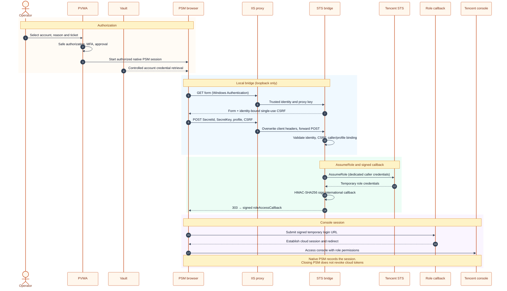
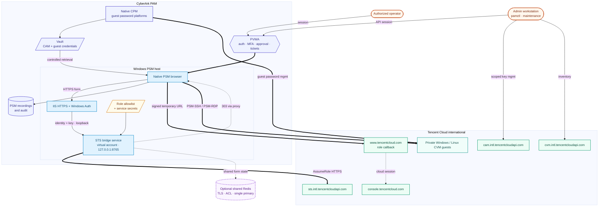

# PSM-TencentCloud-STS

**English** | [简体中文](README.zh-CN.md)

**Start here: [Detailed installation and usage manual](docs/INSTALLATION-AND-USAGE.md)** — prerequisites, Windows/IIS setup, PVWA/PSM, commands, rotation, recovery and troubleshooting.

A Tencent Cloud international console role login bridge for CyberArk PSM, using an architecture similar to AWS Console STS:

## Login flow

The PSM browser submits the Vault credential to an authenticated local bridge; the bridge exchanges it for temporary role credentials. The browser then uses Tencent Cloud's international callback to establish the console session.



## Deployment architecture

Solid lines are requests or managed dependencies; dashed lines are the returned redirect and optional shared-token state. Guest SSH/RDP uses a separate native PSM path.



This package includes a runnable bridge and unit tests. It is not a platform ZIP that can be imported directly into PVWA. Windows deployment, PSM recording, and live Tencent Cloud login have not been validated against a target environment.

## Delivery status and operations

Version 0.5.2 includes strict configuration validation, dedicated caller-to-role binding, Windows install/uninstall scripts, an IIS proxy template, safe audit correlation, CI, a reproducible source archive with a SHA256 manifest and a CycloneDX dependency inventory. Original code uses the MIT license; maintainer: **susunola**.

- [Complete delivery ledger and remaining external dependencies](docs/DELIVERY.md)
- [Native CPM/PSM operations, recovery, maintenance and shared tokens](docs/OPERATIONS.md)
- [PAM capabilities, lifecycle CLI and compatibility boundaries](docs/PAM-CAPABILITIES.md)
- [Deployment, upgrade, rollback and troubleshooting](docs/DEPLOYMENT.md)
- [Acceptance record and release gates](docs/ACCEPTANCE.md)
- [Marketplace submission draft](docs/MARKETPLACE-SUBMISSION.md)
- [Security policy](SECURITY.md) · [Contribution guide](CONTRIBUTING.md) · [Changelog](CHANGELOG.md)

Version 0.2.2 also binds form tokens to proxy identities, uses monotonic expiration and caps concurrent STS issuance at two requests. Overload returns 503/Retry-After; start a new connection after waiting. The installer verifies service readiness.

Run `python scripts/check_config.py settings.json` before deployment. Use the install script documented in the deployment guide; Windows runtime and real PSM/cloud acceptance remain pending. Each caller SecretId can belong to only one profile; use distinct callers for distinct privilege tiers.

Version 0.2.2 adds actual loopback HTTP integration tests against Waitress (cloud calls remain mocked), strict JSON loading including duplicate-key rejection, and sanitized startup failures. GitHub Actions CI is enabled for Windows Server 2025 and Ubuntu 24.04 with Python 3.11–3.14. The workflow pins Actions to specific commits. A matching template is included in `deployment/ci-workflow.yml.template`.

Version 0.3.0 adds `scripts/pamctl.py`: CAM/CVM discovery, guest onboarding proposals, PVWA onboarding and approval/session interfaces, and staged sub-user key rotation. These are administrative workflows, not a certified native CPM package. See the capability guide for prerequisites and commands.

## Files

| File | Purpose |
|---|---|
| `federation.py` | Official SDK STS calls, HMAC-SHA256 signing, and role login URL construction |
| `app.py` | Bridge form, authenticated proxy checks, single-use CSRF, role/caller allowlists, and 303 redirect |
| `settings.example.json` | Server-side role configuration; users cannot submit arbitrary roles or destinations |
| `cam-assume-policy.example.json` | Caller sub-user permission example; replace the account and role |
| `WebFormFields.template.txt` | Credential injection mapping; verify against the installed PSM version |
| `requirements.in` / `requirements.lock.txt` | Runtime dependency ranges and tested versions |
| `requirements.lock.hashes.txt` | Hash-pinned lock for `pip --require-hashes` on the deploy host; regenerate with `scripts/pin_lock_hashes.py` |
| `requirements-dev.txt` | Pinned lint, type-check and coverage tooling used by the quality gate |
| `pyproject.toml` | Packaging metadata plus the ruff, mypy and coverage configuration and their gate |
| `.pre-commit-config.yaml` | Optional git hooks pinned to upstream tags; mirrors the CI quality job |
| `pam/` | Version-neutral cloud lifecycle and PVWA REST components used by `scripts/pamctl.py` |
| `tests/` | Offline tests using mock credentials, mocked cloud APIs and loopback HTTP |

## Tencent Cloud configuration

1. Create a dedicated CAM caller sub-user with API keys. Store its SecretId in the CyberArk account property `TencentSecretId` and its SecretKey in the Vault password field. Do not use root account keys.
2. Create an account-trusted target role with console login enabled. Configure its trust relationship to permit the intended caller, and grant the caller `sts:AssumeRole` permission for that role. Both sides must permit the operation.
3. Attach the required business permissions to the role; start acceptance testing with a read-only role. The bridge does not provision users/roles. The separate administrative toolkit supports staged key rotation; configure native CPM separately if required, and update caller allowlists during cutover.
4. Set the role ARN, allowed SecretIds, and destination in `settings.json`. The default duration is 300 seconds, as this project’s short-lived credential policy. Verify that the current STS API accepts this duration in staging.

## Windows versions

Automated source checks run on **Windows Server 2025 (`windows-2025`) with Python 3.11–3.14**. Windows Server 2019/2022 are untested evaluation candidates, subject to the installed PSM/Connector's vendor support matrix. No Windows version has completed this plugin's end-to-end PSM/IIS acceptance. The Windows CI also exercises installation, service readiness and ACLs with Python 3.13. Windows desktop, Server Core and ARM64 deployment support is not claimed. See the [Windows compatibility matrix](docs/DEPLOYMENT.md).

## Windows PSM deployment

Follow the [step-by-step manual](docs/INSTALLATION-AND-USAGE.md#install). Run `scripts/Install-Bridge.ps1` from full source in administrator PowerShell, supplying a machine-wide Python executable, reviewed WinSW binary, trusted SHA256 and validated settings file. **Do not pre-create the installation directory**; the installer creates it with restricted ACLs.

The installer registers `PSMTencentCloudSTS` under its own virtual account `NT SERVICE\PSMTencentCloudSTS`, installs locked dependencies, generates independent proxy/session keys and checks readiness. The backend listens on `127.0.0.1:8765`; configure the authenticated HTTPS proxy before PSM connections. Service XML and generated IIS configuration contain secrets and must stay protected.

The installed service contains minimal runtime files. Run administrative scripts and tests from a separate full-source environment. Single-node mode uses in-memory form tokens; [multiple-node deployment](docs/INSTALLATION-AND-USAGE.md#advanced) uses shared Redis tokens and a common session key.

## Authenticated HTTPS proxy prerequisite

Configure IIS or an enterprise-controlled reverse proxy on PSM with a dedicated HTTPS site, such as `https://psm-tc-bridge.internal/`, and a trusted certificate.

The proxy must meet all these requirements:

1. Disable anonymous access, enable Windows Authentication, and restrict access to approved PSM session service identities. Confirm the actual account in your environment; the browser must complete integrated authentication.
2. **Remove browser-supplied** `X-PSM-Bridge-Key` and `X-PSM-Authenticated-User` headers. Set the first to the private bridge proxy key and the second to the actual Windows identity authenticated by the proxy. Never forward client-asserted identity values.
3. Forward paths and POST forms to the fixed backend `http://127.0.0.1:8765` while preserving browser-side HTTPS. The bridge validates the actual TCP peer as loopback; do not substitute the remote client address.
4. Restrict proxy key configuration access to administrators and the proxy service, and restrict site access to controlled hosts. Disable tracing of request bodies, cookies, response Location headers, and complete login URLs. Do not retain sensitive material in logs.
5. Reject direct backend requests, missing proxy keys, unauthenticated requests, and forged identity headers. Correct proxy configuration is the authentication boundary; localhost alone is insufficient.
6. **Give every person their own Windows identity** (a PSM shadow user per human). The previous item notes that the authenticated account is usually a PSM session account; that shared shape is exactly what this item rules out. The bridge binds pending form tokens to `X-PSM-Authenticated-User` and records it in the audit log, so a service account shared by all sessions lets concurrent users evict each other's pending token and makes audit attribution impossible. This is a deployment prerequisite, not an acceptance item. If a shared identity is unavoidable, raise `PSM_TC_IDENTITY_CAPACITY` above realistic concurrency and accept that the audit log cannot distinguish users.

The package provides a Windows service installer and an IIS rewrite template. IIS authentication, ARR/URL Rewrite installation and certificates still require environment-specific configuration. Complete them before production use. Do not enable Flask debug mode.

## PVWA platform and connection component

1. Duplicate the Web application sample component shipped with your PSM version and name it `PSM-TencentCloud-STS`. Retain the supported browser, driver, launcher, PID management, and exit handling.
2. Set `LogonURL` to the authenticated HTTPS bridge root URL.
3. Apply `WebFormFields.template.txt` in the stated order and verify custom property expansion syntax for your PSM version. Form element IDs belong to this bridge and do not depend on Tencent Cloud's page DOM.
4. Create or duplicate an appropriate API credential platform and associate this component. Add account properties `TencentSecretId` and `TencentRoleProfile`; the latter selects a server-side profile such as `tc-readonly`. The password field must contain the CAM SecretKey.
5. Do not let session users arbitrarily override profiles, SecretIds, or destinations. Use controlled account/platform authorization and Vault Safe permissions to govern connections.
6. `ClientUserName` is an STS audit label, not an authentication source or independent proof of human identity. Input labels accept 2–256 characters without control characters. Domain names, Chinese characters and long labels are normalized to an ASCII label with a stable hash suffix. Use the request ID and role session name to correlate PSM records; the form label is still client-provided metadata.
7. Submission redirects to Tencent Cloud's role callback and then to the console. Configure successful-login validation for your version; a loaded bridge page does not prove successful cloud login.
8. The PSM Web framework provides browser isolation, PID reporting, recording, and cleanup. The bridge does not implement these functions. Verify them before exporting a formal component package from PVWA.

## Signing and limitations

Tencent Cloud uses `roleAccessCallback`, rather than AWS's `getSigninToken`. The signing string contains action, nonce, secretId, and timestamp. It is signed with the temporary SecretKey using HMAC-SHA256 and Base64 encoding. The temporary token, signature, and destination are URL-encoded.

The long-term SecretKey is used in the HTTPS form submission and server memory, not files, logs, or command-line arguments. Python cannot guarantee memory zeroization. The callback URL **contains temporary credentials** and may be readable by browsers, administrators, or diagnostic tools. Apply your PSM Web baseline to debugging tools and logs, and test user-accessible extraction paths. This implementation does not guarantee that credentials are impossible to extract.

## Rejection audit trail

Every response is logged once as `http_result`. A response with status 400 or above also carries a fixed `reason` code and, once the identity header has passed shape validation, the `proxy_identity` that presented it:

```json
{"event": "http_result", "request_id": "…", "status": 403, "reason": "csrf-rejected", "proxy_identity": "DOMAIN\alice"}
```

Codes are `proxy-peer-rejected`, `proxy-key-rejected`, `identity-header-rejected`, `form-shape-rejected`, `csrf-rejected`, `token-rejected`, `binding-rejected`, `label-rejected`, `token-capacity-exhausted`, `admission-busy`, `token-backend-unavailable`, `issuance-failed` and `unspecified`. Only fixed codes are logged: form values, secrets and vendor text never are. A malformed identity (over-long or containing control characters) is not echoed, but a shape-valid value that failed the comma/whitespace rule is recorded, so header smuggling is visible to monitoring. The aggregate report in `pam/audit.py` still drops identities and reasons; it counts statuses and profile names only.

## Issuance admission and identity bounds

Two deployment-dependent numbers are configurable without a rebuild:

| Variable | Default | Meaning |
|---|---|---|
| `PSM_TC_ISSUANCE_SLOTS` | `3` (one worker thread fewer than `runtime.THREADS`) | Concurrent STS calls per node. A slot is reserved before the single-use token is consumed, so a queued submission never burns a token. |
| `PSM_TC_ISSUANCE_WAIT_SECONDS` | `5` | How long a submission waits for a slot before the bridge answers `503` with `Retry-After`. The wait is bounded because it holds a worker thread. |
| `PSM_TC_IDENTITY_CAPACITY` | `3` per identity | Pending form tokens one identity may hold. The default assumes one Windows identity per person; see the proxy prerequisites. |
| `PSM_TC_MAX_CAM_USERS` | `1000` | Sub-users read by the administrative toolkit. CAM's `ListUsers` has no pagination fields in `v20190116` and returns every sub-user in one response, so this bounds an unbounded reply: raise it deliberately for a larger organisation and expect a bigger response. |

Submissions queue for up to `PSM_TC_ISSUANCE_WAIT_SECONDS` and then receive `503` with `Retry-After`. PSM's form submission does not retry on its own, so a burst that exceeds both the slot count and the wait will still surface an error page; size the slots against your peak concurrent logins.

The requested STS duration is 300 seconds. Console cookie lifetime and PSM timeouts must be validated separately. Closing a PSM session does not revoke issued credentials. The package does not implement cloud session revocation or forced global logout.

International endpoints and ordinary CAM roles are implemented; mainland console callbacks and service roles are outside the configured scope. Keep cloud-side login policies, network restrictions, and MFA conditions effective. Requests that fail policy requirements must fail rather than bypassing those requirements.

## Validation

Run the quality gate from the full-source directory after creating the management `.venv` described in the manual:

```powershell
& .\.venv\Scripts\python.exe -m ruff check .
& .\.venv\Scripts\python.exe -m mypy
& .\.venv\Scripts\python.exe -m coverage run -m unittest discover -s tests
& .\.venv\Scripts\python.exe -m coverage report
```

`mypy` reads its target list from `pyproject.toml`, so the checked surface (the bridge, federation, security, `pam/` and `scripts/`) is defined in one place. `coverage report` enforces the 95% threshold declared in `pyproject.toml` — currently measured at 99.5%, with 14 of 16 modules at 100% — so a change that removes coverage fails the gate.

Ruff checks lint only. Formatting is deliberately not enforced because the test and script suites keep intentional compact one-liners.

CI additionally runs the quality job (lint, mypy, coverage gate and a dependency-hash completeness check), a dependency-advisory audit of the pinned lock, a guard-mutation job that disables one security guard at a time and requires the suite to fail, and a real Redis job for the shared-token backend.

Beyond example-based tests, two suites pin behaviour that examples cannot:

- `tests/test_properties.py` drives the security-critical validators with generated input: no destination other than the console host is ever accepted, a normalized audit label is always log-safe and bounded, an accepted route can never escape the API prefix, a size bound is never exceeded, and a failure message never echoes the credential material it was given.
- `tests/test_rotation_invariants.py` runs the rotation state machine as a Hypothesis model, driving random sequences of prepare/finalize/restore/recover and asserting after every step that a reported cutover left exactly one live key, that a key is only retired once another key was verified as the target identity, and that rotation never ends with zero usable credentials.

`python scripts/check_guard_mutations.py` turns that rigour into a measurement: it disables each security guard in turn and reports how many the suite actually notices (currently 12 of 12). `python -m pip_audit -r requirements.lock.txt` reports published advisories for the pinned dependencies.

Tests cover signing and encoding, destination restrictions, proxy authentication, CSRF replay, role/caller allowlists, SDK request construction, expiring credentials, validation and sanitization of every CLI/API boundary, staged-rotation state transitions, and redacted errors. Mock STS and cloud calls do not establish live login compatibility.

For environment acceptance, verify role identity after login and failures for invalid keys or unauthorized roles. Reject altered profiles, replayed forms, and proxy bypasses. Check cookie isolation across users, STS audit label correlation, recording playback, browser cleanup after timeout/exit, and actual console session lifetime. Inspect browser, proxy, and service diagnostics for long-term key or temporary URL exposure. Mark the integration production-ready only after acceptance passes.

## Official references

- [Tencent Cloud role console login](https://www.tencentcloud.com/document/product/614/36997)
- [Using Tencent Cloud roles](https://www.tencentcloud.com/document/product/598/19419)
- [Tencent Cloud Python SDK](https://github.com/TencentCloud/tencentcloud-sdk-python)
- [CyberArk Web applications for PSM](https://docs.cyberark.com/pam-self-hosted/latest/en/Content/PASIMP/psm_WebApplication.htm) — select your installed version.

This is an independent implementation. It contains no proprietary CyberArk SDK and is not a CyberArk Marketplace-certified product.

International endpoint references: [AssumeRole](https://www.tencentcloud.com/document/product/1150/49456), [GetCallerIdentity](https://www.tencentcloud.com/document/product/1150/49453), [CAM ListAccessKeys](https://www.tencentcloud.com/zh/document/api/598/37088), [CVM DescribeInstances](https://www.tencentcloud.com/document/product/213/33258). The role callback specification is published in the official **Embedding CLS Console (old scheme)** page; live login to the configured console destination still requires acceptance.
