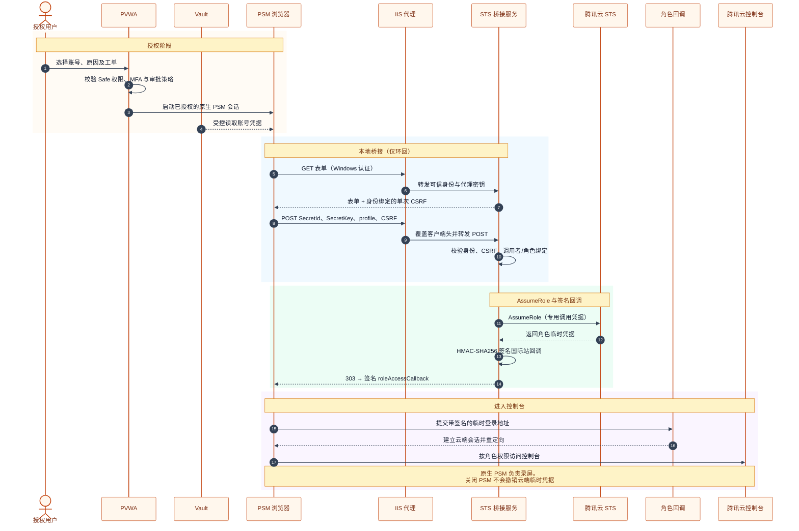
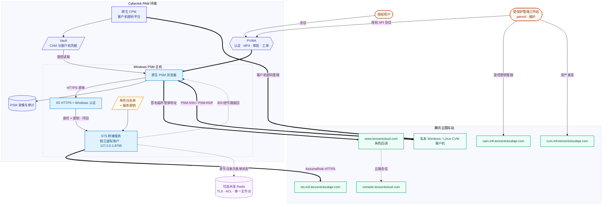

# PSM-TencentCloud-STS

[English](README.md) | **简体中文**

**从这里开始：[详细安装与使用手册](docs/INSTALLATION-AND-USAGE.zh-CN.md)** — 部署准备、Windows/IIS 安装、PVWA/PSM 配置、完整命令、轮换恢复与排错。

腾讯云国际站控制台角色登录连接组件源码包，采用 AWS Console STS 同类架构：PVWA 授权 → PSM Web 注入 Vault 凭据 → 登录桥接服务调用 STS AssumeRole → 生成腾讯云角色登录签名 → PSM 浏览器进入控制台。

## 登录原理与整体流程

PSM 浏览器将 Vault 凭据提交到已认证的本地桥接服务，由服务换取角色临时凭据；浏览器再经腾讯云国际站签名回调建立控制台会话。



## 部署架构

实线表示请求或受控依赖；虚线表示返回浏览器的重定向及可选共享令牌状态。客户机 SSH/RDP 使用独立的原生 PSM 路径。



本包包含可运行的桥接服务和单元测试。它不是直接导入 PVWA 的平台 ZIP；缺少现场 PSM 版本、Web 框架和腾讯云测试账号，尚未完成 Windows、PSM 录屏或腾讯云真实登录验收。

## 交付状态与运维

0.5.2 已补充严格配置校验、调用密钥与角色独占绑定、Windows 安装/卸载脚本、IIS 代理模板、安全审计关联、CI、可重现源码包、SHA256 清单与 CycloneDX 依赖清单。原创代码采用 MIT 许可，维护者为 **susunola**。

- [完整交付清单与剩余外部依赖](docs/DELIVERY.zh-CN.md)
- [原生 CPM/PSM 操作、恢复、定时维护和共享令牌](docs/OPERATIONS.zh-CN.md)
- [PAM 能力、生命周期工具与兼容性边界](docs/PAM-CAPABILITIES.zh-CN.md)
- [部署、升级、回滚和排错](docs/DEPLOYMENT.zh-CN.md)
- [验收记录与发布门槛](docs/ACCEPTANCE.zh-CN.md)
- [Marketplace 提交草稿（英文）](docs/MARKETPLACE-SUBMISSION.md)
- [安全策略](SECURITY.md) · [贡献说明](CONTRIBUTING.md) · [变更记录](CHANGELOG.md)

0.2.2 还将表单令牌绑定代理身份、使用单调时钟判断过期、限制 STS 并发为两个请求；超载返回 503/Retry-After，等待后需发起新连接。安装器会验证服务就绪。

部署前执行 `python scripts/check_config.py settings.json`。每个 SecretId 只能属于一个角色配置；不同权限等级使用不同调用主体。Windows 运行与真实 PSM/腾讯云验收仍待完成。

0.2.2 增加了真实环回 HTTP/Waitress 集成测试（云端调用仍使用模拟）、重复 JSON 键拒绝和启动错误脱敏。GitHub Actions CI 已启用，覆盖 Windows Server 2025、Ubuntu 24.04 的 Python 3.11–3.14。Actions 固定到具体提交，模板同步保存在 `deployment/ci-workflow.yml.template`。

0.3.0 增加 `scripts/pamctl.py`：CAM/CVM 发现、客户机纳管规划、PVWA 纳管与审批/会话接口、子用户密钥两阶段轮换。这些是独立管理流程，尚未认证为原生 CPM 包；环境要求和命令见能力说明。

## 文件

- `federation.py`：官方 SDK 调用 STS、HMAC-SHA256 签名和角色登录链接构造。
- `app.py`：桥接表单、认证代理校验、单次 CSRF、角色和调用 SecretId 白名单、303 重定向。
- `settings.example.json`：服务端角色配置，用户不能通过表单指定任意角色或目的 URL。
- `cam-assume-policy.example.json`：调用子用户的 AssumeRole 权限示例，替换账号和角色后使用。
- `WebFormFields.template.txt`：PSM Web 凭据注入映射，必须与安装版本核对。
- `requirements.in`：依赖范围；部署使用本包 `requirements.lock.txt` 的实际测试版本。
- `requirements.lock.hashes.txt`：供部署主机 `pip --require-hashes` 使用的哈希锁定文件，用 `scripts/pin_lock_hashes.py` 重新生成。
- `requirements-dev.txt`：质量门禁使用的固定版本 lint、类型检查与覆盖率工具。
- `pyproject.toml`：打包元数据，以及 ruff、mypy、覆盖率的配置与门禁。
- `.pre-commit-config.yaml`：可选的 git 钩子，固定到上游 tag，与 CI 质量任务一致。
- `pam/`：与版本无关的云生命周期与 PVWA REST 组件，供 `scripts/pamctl.py` 使用。
- `tests/`：离线自动化验证，使用模拟凭据、模拟云接口和本地回环 HTTP。

## 腾讯云配置

1. 创建专用 CAM 调用子用户，为其开通 API 密钥。将 SecretId 保存到 CyberArk 账号属性 `TencentSecretId`，SecretKey 保存到 Vault 密码字段。不要使用主账号密钥。
2. 创建角色载体为账号的目标角色，并允许其登录控制台。配置角色信任关系，允许指定调用主体扮演；同时给调用子用户授予作用于该角色的 `sts:AssumeRole` 权限。信任关系与调用权限两边都必须生效。
3. 给目标角色绑定业务所需权限，先用只读角色验收。桥接服务不创建用户、角色或广泛的管理权限。独立管理工具提供两阶段密钥轮换；原生 CPM 按需另行配置，切换时同步角色白名单。
4. 配置 `settings.json` 中的角色 ARN、允许的 SecretId 和目标页面。默认 300 秒，作为本项目短期凭据策略；在测试环境确认当前 STS 接口接受这个时长。

## Windows 版本范围

自动化源码验证覆盖 **Windows Server 2025（`windows-2025`）＋Python 3.11–3.14**。**Windows Server 2022／2019／2016 已于 2026-10-08 在腾讯云真实 CVM 上通过 Bridge 安装／服务验收**，使用 Python 3.13.7、Windows PowerShell 5.1 和 WinSW 2.12.0，详见[实测报告](docs/WINDOWS-CVM-ACCEPTANCE.zh-CN.md)。部署仍须符合实际 PSM／Connector 的官方支持矩阵。Windows CI 还使用 Python 3.13 执行安装、服务就绪及 ACL 检查。目前没有 Windows 版本完成本插件端到端 PSM／IIS 验收；不声明支持桌面 Windows、Server Core 或 ARM64 部署。详见 [Windows 兼容矩阵](docs/DEPLOYMENT.zh-CN.md)。

## 桥接服务部署到 Windows PSM

按[手册的安装步骤](docs/INSTALLATION-AND-USAGE.zh-CN.md#install)操作。在完整源码目录打开管理员 PowerShell，执行 `scripts/Install-Bridge.ps1`，提供机器级 Python、经审核的 WinSW、可信 SHA256 和已校验配置。**不要预先创建安装目录**，由安装器创建并设置受限 ACL。

安装器以专用虚拟账号 `NT SERVICE\PSMTencentCloudSTS` 注册 `PSMTencentCloudSTS`，安装锁定依赖、生成独立代理/会话密钥并检查就绪。后端监听 `127.0.0.1:8765`，接入 PSM 前先配置 HTTPS 认证代理。服务 XML 和生成的 IIS 配置含秘密，必须保护。

服务目录只包含最小运行文件；管理工具和测试在独立的完整源码环境执行。单节点使用内存表单令牌；[多节点模式](docs/INSTALLATION-AND-USAGE.zh-CN.md#advanced)使用 Redis 共享令牌和统一会话签名密钥。

## HTTPS 认证代理（部署前置条件）

在 PSM 上配置 IIS 或企业受控反向代理，提供独立 HTTPS 站点，例如 `https://psm-tc-bridge.internal/`，使用受信任证书。

必须满足以下代理契约，服务才会接受请求：

1. 在代理层关闭匿名访问，启用 Windows Authentication，并限制至允许的 PSM 会话服务身份。实际身份通常是 PSM 会话账户，必须现场确认。浏览器应在该站点正确完成集成认证。
2. **删除浏览器传入的** `X-PSM-Bridge-Key` 和 `X-PSM-Authenticated-User`，随后由代理重新设置：前者为与服务一致的私密代理密钥，后者为代理认证出的实际 Windows 身份。不能将客户端自报身份复制进去。
3. 代理连接固定的 `http://127.0.0.1:8765`，原样转发路径及 POST 表单，并保持浏览器端 HTTPS。不需要把客户端 IP 改写为远端地址，后端按真实 TCP 对端校验环回。
4. 代理密钥所在配置仅允许代理服务和管理员读取；只允许受控主机访问站点。关闭对请求正文、Cookie、响应 Location 和完整登录链接的跟踪；日志中不保留敏感材料。
5. 直接请求后端、不带代理密钥、未完成代理认证，以及伪造身份头的请求都应被拒绝。正确配置代理是认证边界；仅绑定 localhost 不构成完整鉴权。
6. **每个真实用户必须有独立的 Windows 身份**（PSM shadow user）。上一条提到「实际身份通常是 PSM 会话账户」，那种共享身份正是本条要排除的部署形态：桥接服务把待用表单令牌绑定到 `X-PSM-Authenticated-User` 并写入审计日志，若所有会话共用一个账号，并发用户会互相挤掉待用令牌，且**审计无法归因到人**。这是部署前置条件，不是验收项。若确实无法做到一人一身份，请把 `PSM_TC_IDENTITY_CAPACITY` 提到高于实际并发量，并接受审计日志无法区分用户。

本包提供 Windows 服务安装脚本和 IIS 重写模板；IIS 认证、ARR/URL Rewrite 安装和证书仍需根据现场 PSM 加固与版本配置。完成此段配置后再接入生产。不要开放 Flask debug 模式。

## PVWA 平台与连接组件

1. 复制当前 PSM 版本的 Web 应用示例连接组件，命名为 `PSM-TencentCloud-STS`，继承受支持的浏览器、驱动、启动程序、PID 管理与退出流程。
2. 将 `LogonURL` 配置为上述 HTTPS 桥接根地址。
3. 按 `WebFormFields.template.txt` 填写注入顺序，并核对本版本的自定义账号属性展开语法。所有字段 ID 都由本包定义，不依赖腾讯云页面 DOM。
4. 新建或复制适用的 API 凭据平台，关联本组件。增加账号属性 `TencentSecretId`、`TencentRoleProfile`；后者填写服务端已定义的 `tc-readonly` 等配置键。确保密码字段实际保存的是 CAM SecretKey。
5. 不把角色配置、SecretId 或目的地址开放为会话用户可任意覆盖的参数。对不同角色采用受控的账号/平台授权，Vault Safe 的使用权限控制谁能发起连接。
6. `ClientUserName` 默认作为 STS 会话审计标签。它不是桥接服务认证依据，不能单独证明人类操作者身份；输入标签接受不含控制字符的 2..256 字符；域名、汉字和长标签会被规范化为带稳定哈希后缀的 ASCII 标签。通过请求 ID 和角色会话名关联 PSM 记录；标签仍是客户端提交的元数据。
7. 表单提交后桥接服务重定向至腾讯云角色登录回调，然后腾讯云跳转目标控制台。根据安装版本配置登录成功验证；不能把桥接页加载成功视为腾讯云登录成功。
8. 本实现由 Web 连接框架负责浏览器隔离、PID 上报、录屏和会话清理。桥接服务本身不承担这些功能。必须确认它们确实生效，再从 PVWA 导出正式组件包。

## 登录签名与限制

腾讯云流程使用 `roleAccessCallback`，没有照搬 AWS 的 `getSigninToken` 接口。签名字符串包含 action、nonce、secretId、timestamp；使用临时 SecretKey 做 HMAC-SHA256 后 Base64 编码，最后将临时 Token、签名和目的页面进行 URL 编码。

长期 SecretKey 只在 HTTPS 表单和服务端内存中使用，不写入文件、日志或命令行；Python 无法保证内存清零。生成的回调 URL **含临时访问凭据**，不是普通链接：浏览器、管理员或诊断工具可能读到它。需要按 PSM Web 安全基线限制调试工具和日志，并验收是否存在用户可获取凭据的路径；本源码不承诺凭据绝对不可提取。

## 签发准入与身份额度

两个与部署形态相关的数值无需重新构建即可配置：

| 变量 | 默认 | 含义 |
|---|---|---|
| `PSM_TC_ISSUANCE_SLOTS` | `3`（比 `runtime.THREADS` 少一个线程） | 每节点并发 STS 调用数。槽位在消费单次令牌**之前**预留，因此排队中的提交不会白白烧掉令牌。 |
| `PSM_TC_ISSUANCE_WAIT_SECONDS` | `5` | 提交等待槽位的时长，超时后返回 `503` 与 `Retry-After`。等待有上限，因为期间会占用一个工作线程。 |
| `PSM_TC_IDENTITY_CAPACITY` | 每身份 `3` | 单个身份可持有的待用表单令牌数。默认值假设一人一个 Windows 身份，详见代理前置条件。 |
| `PSM_TC_MAX_CAM_USERS` | `1000` | 管理工具读取的子用户数上限。CAM 的 `ListUsers` 在 `v20190116` 中没有任何分页字段，会一次返回全部子用户，因此这是对无界响应设的上界：大型组织需主动提高并接受更大的响应体。 |

提交会排队至多 `PSM_TC_ISSUANCE_WAIT_SECONDS`，之后返回 `503` 与 `Retry-After`。PSM 的表单提交不会自动重试，因此超过槽位数与等待时长的突发流量仍会看到错误页；请按峰值并发登录量设置槽位数。

300 秒是 STS 凭据申请时长。控制台 Cookie 寿命和 PSM 会话超时必须单独验证；关闭 PSM 会话不等于撤销已发出的临时凭据。本包不实现腾讯云会话撤销或强制全局登出。

当前实现国际站普通 CAM 角色；中国站控制台回调和服务角色不在当前配置范围内。登录策略、网络限制、MFA 条件应在腾讯云侧保持生效；若策略要求而调用不满足，连接应失败，不通过降级策略绕过。

## 验证

在完整源码目录，按手册创建管理用 `.venv` 后执行完整质量门禁：

```powershell
& .\.venv\Scripts\python.exe -m ruff check .
& .\.venv\Scripts\python.exe -m mypy
& .\.venv\Scripts\python.exe -m coverage run -m unittest discover -s tests
& .\.venv\Scripts\python.exe -m coverage report
```

`mypy` 的检查范围由 `pyproject.toml` 统一声明（桥接、federation、security、`pam/` 与 `scripts/`），只需维护一处。`coverage report` 执行 `pyproject.toml` 中声明的 95% 阈值——当前实测 99.5%，16 个模块中 14 个为 100%——覆盖率下降会直接使门禁失败。

ruff 只做代码检查，刻意不强制格式化：测试与脚本保留了有意为之的紧凑写法。

CI 另设质量任务（lint、mypy、覆盖率门禁与依赖哈希完整性校验）、依赖漏洞公告审计、守卫突变任务（逐个禁用一项安全守卫并要求测试失败），以及针对共享令牌后端的真实 Redis 任务。

除示例测试外，有两个套件固定了示例无法覆盖的行为：

- `tests/test_properties.py` 以生成式输入驱动安全关键校验器：除控制台域名外任何目的域都不会被接受、归一化后的审计标签始终是日志安全且有界的、被接受的路由无法逃出 API 前缀、大小上限永不被突破、失败信息绝不回显它收到的凭据材料。
- `tests/test_rotation_invariants.py` 把轮换状态机作为 Hypothesis 模型运行，随机演练 prepare/finalize/restore/recover 序列，并在每一步后断言：报告完成的切换恰恰剩下一把存活密钥、只有在另一把密钥被验证为目标身份后才退休、轮换绝不会以零可用凭据收场。

`python scripts/check_guard_mutations.py` 把这份严谨变成可测量指标：逐个禁用安全守卫并报告测试实际能发现多少个（当前 12/12）。`python -m pip_audit -r requirements.lock.txt` 报告锁定依赖的已发布漏洞公告。

测试覆盖签名与 URL 编码、目的域名约束、代理认证边界、CSRF 重放、角色及调用者白名单、SDK 请求构造、凭据过期、各 CLI/API 边界的校验与脱敏、两阶段轮换状态迁移，以及失败信息脱敏。使用模拟 STS 与模拟云接口，不证明云端登录兼容性。

现场验收：正确调用密钥/角色登录后核对角色身份；错误密钥、无授权角色明确失败；尝试修改表单角色、重放表单、绕过代理应被拒绝；检查 Cookie 隔离和两名用户连续会话；确认 STS 审计标签可与 PSM 记录关联；确认录屏可回放、超时和退出后浏览器清理；检查实际控制台会话有效期；检查浏览器及所有层日志不会泄露长期密钥或临时登录链接。完成后才标为生产可用。

## 官方依据

- 腾讯云角色免密登录控制台：https://www.tencentcloud.com/document/product/614/36997
- 腾讯云使用角色：https://www.tencentcloud.com/document/product/598/19419
- 腾讯云 STS Python SDK：https://github.com/TencentCloud/tencentcloud-sdk-python
- CyberArk Web applications for PSM（选择安装版本）：https://docs.cyberark.com/pam-self-hosted/latest/en/Content/PASIMP/psm_WebApplication.htm

本包为独立实现，不包含 CyberArk 专有 SDK，也不是 CyberArk Marketplace 认证产品。

国际站接口依据：[AssumeRole](https://www.tencentcloud.com/document/product/1150/49456)、[GetCallerIdentity](https://www.tencentcloud.com/document/product/1150/49453)、[CAM ListAccessKeys](https://www.tencentcloud.com/zh/document/api/598/37088)、[CVM DescribeInstances](https://www.tencentcloud.com/document/product/213/33258)。角色回调规范见官方 **Embedding CLS Console (old scheme)** 页面；配置的控制台目的页仍需真实登录验收。
